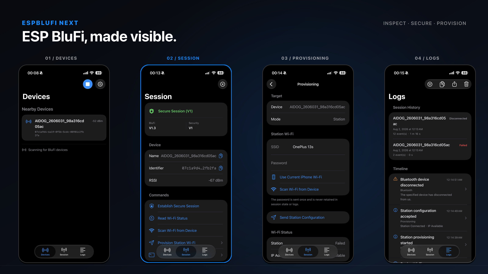

# EspBluFiNext

EspBluFiNext 是面向 Espressif [BluFi 协议](https://docs.espressif.com/projects/esp-idf/en/stable/esp32/api-guides/ble/blufi.html)兼容 ESP32 设备的现代原生 iOS 26 调试客户端，提供[低功耗蓝牙](https://developer.apple.com/documentation/corebluetooth)设备发现、连接、配网、状态查看和诊断能力。

[English](README.md)

<p align="center">
  
</p>

[许可证](LICENSE) · [第三方声明](THIRD-PARTY-NOTICES.md) · [品牌规范](docs/BRANDING.md)

## 项目定位

项目已实现 BLE、BluFi 协议、安全协商、Wi-Fi 配网、自定义数据、诊断日志和自签名构建流程。已确认的硬件基线为：

- ESP32-S3
- ESP-IDF 5.5.2
- BluFi 1.3
- Security V1
- Station 配网

其他芯片、ESP-IDF 6.x/V2、SoftAP/APSTA 行为和更广泛的固件组合需要单独进行真机验证。

BluFi 处于乐鑫维护模式。EspBluFiNext 聚焦现有 BluFi 固件的调试与互操作。请使用已更新的固件，并验证目标设备的安全行为。

## 代码结构

```text
SwiftUI 界面
    ↓
AppCoordinator / BluFiSessionController / BluFiDiagnosticsStore
    ↓
BluFiCoreBluetoothTransport + BluFiScanner
    ↓
BluFiKit（帧、CRC、分片、安全、配网、Fake Transport）
```

- `project.yml`：XcodeGen 工程配置，定义 Target、资源、包依赖、构建设置和 Scheme。
- `Sources/EspBlufiNext`：SwiftUI 界面、App 协调、CoreBluetooth、配网、自定义数据、本地化、设置和诊断。
- `Packages/BluFiKit`：与传输层无关的 BluFi 帧、安全、会话、配网载荷与解析，以及测试传输层。
- `Tests/EspBlufiNextTests`：App 层测试。
- `Packages/BluFiKit/Tests`：协议、安全、配网和故障恢复测试。
- `scripts/build-ios.sh`：模拟器或真机构建。
- `scripts/archive-ios.sh`：生成 Release 归档。
- `scripts/export-ios.sh`：导出签名 IPA。

协议行为位于 BluFiKit，[Core Bluetooth](https://developer.apple.com/documentation/corebluetooth) 行为位于传输层，[SwiftUI](https://developer.apple.com/documentation/swiftui) 界面状态转换位于 App 层。生成的 Xcode 工程和本地签名配置不进入版本控制。

## 主要功能

- 发现附近 ESP BluFi 设备并查看名称、标识符、RSSI、BluFi 版本和安全状态。
- 连接、重连、断开设备并观察 Bluetooth/GATT 状态变化。
- 建立 BluFi 安全会话并读取设备 Wi-Fi 状态。
- 从设备扫描 Wi-Fi 网络并查看 SSID/RSSI。
- 使用手动输入、当前 iPhone Wi-Fi SSID 或设备扫描结果完成 Station 配网。
- 显示设备上报的 Station Connected 和 IP Available 状态。
- 以 UTF-8、Hex、Base64 格式收发自定义数据。
- 保存脱敏会话历史和诊断事件，支持删除单条会话、清空历史、复制筛选后的日志和通过 iOS 分享面板导出诊断数据。
- 支持英文和简体中文。

## 环境要求

- macOS，以及包含 iOS 26 SDK 和 [Swift 6](https://www.swift.org/) 的 [Xcode 26 或更高版本](https://developer.apple.com/xcode/)。
- [XcodeGen](https://github.com/yonaskolb/XcodeGen)：`brew install xcodegen`。
- 用于蓝牙和 ESP 测试的真实 iPhone 或 iPad。
- 用于真机构建和侧载的 [Apple Developer](https://developer.apple.com/account/) Team、证书、已注册 Bundle ID 和 Provisioning Profile。
- 与测试场景兼容的 [ESP BluFi](https://docs.espressif.com/projects/esp-idf/en/stable/esp32/api-guides/ble/blufi.html) 固件。

模拟器可验证界面、导航、状态处理、诊断、本地化和包测试。CoreBluetooth 扫描、GATT 通信、安全协商、配网和固件兼容性需要真实 Apple 设备与 ESP 硬件。

## 工具链配置

安装 [Xcode 26 或更高版本](https://developer.apple.com/xcode/)。电脑中存在多个 Xcode 版本时，选择需要使用的版本。标准安装路径示例：

```bash
sudo xcode-select --switch /Applications/Xcode.app/Contents/Developer
sudo xcodebuild -license accept
sudo xcodebuild -runFirstLaunch
brew install xcodegen

xcode-select -p
xcodebuild -version
xcrun --sdk iphonesimulator --show-sdk-version
```

构建脚本默认使用 `xcode-select` 选中的开发者目录，也支持通过 `DEVELOPER_DIR` 指定其他 Xcode 安装。[Homebrew](https://brew.sh/) 用于安装 XcodeGen。

## 本地签名配置

将签名信息保存在已忽略的本地配置中：

```bash
cp Config/Local.xcconfig.example Config/Local.xcconfig
# 编辑 Config/Local.xcconfig，填写 DEVELOPMENT_TEAM。
```

App 使用 Bundle ID `com.espblufi.next`，并使用 [NEHotspotNetwork](https://developer.apple.com/documentation/networkextension/nehotspotnetwork) 读取当前 iPhone Wi-Fi SSID。[Apple Developer 账号](https://developer.apple.com/account/)需要能够为该 Bundle ID 和描述文件签名。

## 模拟器构建

生成工程并构建未签名的 iOS 模拟器版本：

```bash
xcodegen generate
./scripts/build-ios.sh
```

等价的直接构建命令：

```bash
xcodebuild \
  -project EspBlufiNext.xcodeproj \
  -scheme EspBlufiNext \
  -destination 'generic/platform=iOS Simulator' \
  CODE_SIGNING_ALLOWED=NO \
  build
```

## 真机构建

使用本地签名团队构建通用 iOS 真机版本：

```bash
DESTINATION='generic/platform=iOS' ./scripts/build-ios.sh
```

从 Xcode 安装时，选择已连接的 iPhone 或 iPad 作为运行目标，并按系统提示授予蓝牙和定位权限。iOS 读取当前 Wi-Fi 网络名称需要定位权限。

## 归档与自签名

仓库发布源代码和可复现的本地构建步骤。每位使用者使用自己的 Apple Team 签名 IPA。

创建导出配置：

```bash
cp Config/ExportOptions.plist.example Config/ExportOptions.plist
# 填写 teamID 和 com.espblufi.next 对应的 Development Provisioning Profile。
```

创建 Release 归档，并按需覆盖版本号：

```bash
MARKETING_VERSION=0.1.0 \
CURRENT_PROJECT_VERSION=1 \
./scripts/archive-ios.sh
```

导出签名 IPA：

```bash
./scripts/export-ios.sh
```

产物位置：

```text
build/archive/EspBlufiNext.xcarchive
build/export/EspBlufiNext.ipa
```

导出模板使用手动开发签名。请替换 Team ID、证书和描述文件，或使用自己的 Xcode 账号生成等价的导出配置。`Config/Local.xcconfig`、`Config/ExportOptions.plist`、归档和导出产物均已被 Git 忽略。

仅验证 Release 构建时：

```bash
CODE_SIGNING_ALLOWED=NO \
CODE_SIGNING_REQUIRED=NO \
./scripts/archive-ios.sh
```

生成的归档需要有效签名后才能安装。发布版本会在 [GitHub Releases](https://github.com/Shi1xin/EspBluFiNext/releases/latest) 提供开发签名 IPA。

没有自己的 Apple Developer 签名配置时，可以考虑使用 [Sideloadly](https://sideloadly.io/) 等侧载工具安装 IPA。Apple ID、签名、设备数量和有效期限制以所选工具当前说明为准。TestFlight 和 App Store Connect 不在当前发布流程内。

## 测试与验证

运行与传输层无关的协议测试：

```bash
swift test --package-path Packages/BluFiKit
```

在指定模拟器上运行 App 测试：

```bash
xcodebuild \
  -project EspBlufiNext.xcodeproj \
  -scheme EspBlufiNext \
  -destination 'platform=iOS Simulator,id=<SIMULATOR_UDID>' \
  CODE_SIGNING_ALLOWED=NO \
  test
```

协议测试覆盖帧编码、CRC、分片、ACK、传输取消、V1/V2 安全向量、Wi-Fi 状态与扫描解析、配网载荷和无效安全输入。App 测试覆盖导航、数据格式、诊断持久化、脱敏和会话历史。

扫描、连接、GATT 写入、通知、安全协商、Wi-Fi 状态、设备 Wi-Fi 扫描、Station 配网、设备上报连接事件和断线恢复需要使用真实 iPhone 或 iPad 与 ESP 硬件验证。

## 项目声明

- EspBluFiNext 自有源代码使用 [MIT License](LICENSE)。
- [第三方声明](THIRD-PARTY-NOTICES.md) 包含 BigInt 的 MIT 许可证和 Espressif BluFi 参考项目声明。
- App 未捆绑 Espressif Android/Objective-C 参考源代码、OpenSSL 头文件或库、ESP-IDF 源代码。未来加入第三方文件时，需要保留准确的文件级许可证和声明。
- EspBluFiNext 是独立项目，与 Espressif Systems (Shanghai) Co., Ltd. 无隶属、赞助或背书关系。`ESP32` 和 `BluFi` 仅用于描述兼容性。
- App 图标、截图和宣传素材使用自有资产；[品牌规范](docs/BRANDING.md) 说明了可用措辞和素材规则。

## 参考资料与工具

- 协议：[乐鑫 BluFi 文档](https://docs.espressif.com/projects/esp-idf/en/stable/esp32/api-guides/ble/blufi.html)和 [ESP-IDF BluFi 示例](https://github.com/espressif/esp-idf/tree/release/v5.5/examples/bluetooth/blufi)。
- Apple 平台：[Core Bluetooth](https://developer.apple.com/documentation/corebluetooth)、[SwiftUI](https://developer.apple.com/documentation/swiftui) 和 [NEHotspotNetwork](https://developer.apple.com/documentation/networkextension/nehotspotnetwork)。
- 构建工具：[Xcode](https://developer.apple.com/xcode/)、[Swift](https://www.swift.org/)、[Swift Package Manager](https://www.swift.org/documentation/package-manager/)、[XcodeGen](https://github.com/yonaskolb/XcodeGen) 和 [Homebrew](https://brew.sh/)。
- 依赖：[BigInt](https://github.com/attaswift/BigInt)，BluFiKit 使用它实现 BluFi 安全逻辑。
- 发布与侧载：[GitHub Releases](https://github.com/Shi1xin/EspBluFiNext/releases/latest) 和 [Sideloadly](https://sideloadly.io/)。
- 安全背景：[ESP-IDF BluFi 安全公告](https://github.com/espressif/esp-idf/security/advisories/GHSA-9w88-r2vm-qfc4)。
